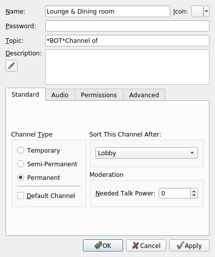

# TeamSpeak 3 Bot
Use the [TeamSpeak 3 API](https://github.com/TheHolyWaffle/TeamSpeak-3-Java-API) by [TheHolyWaffle](https://github.com/TheHolyWaffle) to create dynamic channels.

# Features
### Channel bot
- Dynamic channel creation/deletion
- Grant channel commander permission for the created channel

### Legacy bot
- Give the ownership to another user after the channel commander left the dynamic channel
- Rename the dynamic channel accordingly

# Run with docker
- [Get docker](https://docs.docker.com/get-docker/) and install it your machine/server/vserver
- Create a server query user ([TeamSpeak3 add server query tutorial](https://www.teamspeak3.com/support/teamspeak-3-add-server-query-user.php#:~:text=At%20the%20top%20of%20the,the%20%22ServerQuery%20Login%22%20option.&text=Type%20in%20the%20server%20query,for%20you%20to%20login%20with.)).
- Create a directory where your bot shall reside `mkdir tsbot`
- Copy all files from the [installation](./installation) directory  into the `tsbot` directory.
- Update the [env.list](./installation/env.list)

# Define dynamic channels
To make a channel dynamic you have to put the `TSBOT_TOPIC_KEYWORD` in the channel topic followed by a text of your choice.

If `J03D03` joins this channel a temporary sub-channel `'Channel of J03D03'` will be created and he will be switched immediately.

# Start the bot
After you have configured everything to your needs
- run `./startChannelBot.sh` for the dynamic channel creation
- run `./startLegacyBot.sh` for updating the channels after a channel commander left

# Feel free to contribute
Open an issues, state a problem or create a pull request.
